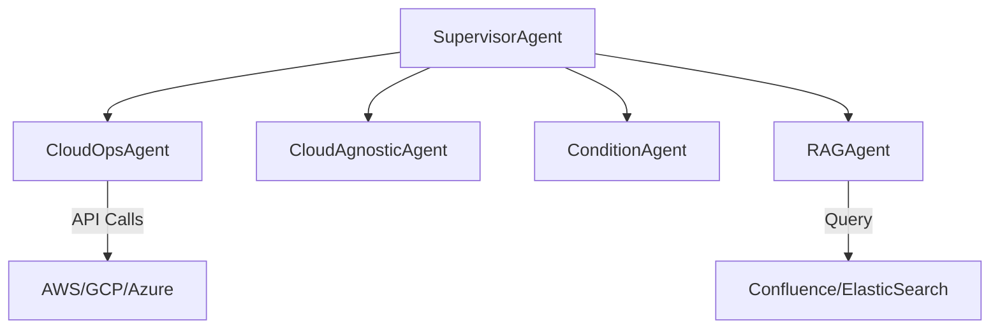

# 🚀 AgenticAI – Multi-Agent & Cloud-Agnostic AI Systems  

[](LICENSE)    

AgenticAI is a collection of **modular AI agent systems** for building, testing, and deploying intelligent cloud-agnostic workflows.  
This repository explores **LangGraph, MCP, RAG, A2A communication, and multi-agent orchestration**, making it a powerful playground for applied agentic AI development.  

---

## 📂 Project Structure  

- **`A2a/`** → Agent-to-Agent communication prototypes for inter-agent messaging and coordination.  
- **`Rag/`** → Retrieval-Augmented Generation (RAG) experiments for knowledge-grounded responses.  
- **`agentic_ai_poc/`** → Proof-of-concepts for different agentic AI workflows.  
- **`cloud_agnostic_agent/`** → Agents designed to work across multiple cloud providers (AWS, GCP, Azure).  
- **`cloudops_agent/`** → Specialized agent for cloud operations, monitoring, and automation tasks.  
- **`condtion_agent/`** → Conditional agents that act based on predefined rules and contexts.  
- **`confluence/`** → Integrations with Confluence knowledge bases.  
- **`elastic_confluence_rag/`** → Hybrid RAG implementation combining Confluence docs + ElasticSearch.  
- **`langgraph_mcp_agent/`** → LangGraph + MCP-based agent with tool orchestration.  
- **`mult_agent_system/`** → Full multi-agent system implementation with supervisor/sub-agents.  

---

## ✨ Key Features  

- ⚡ Modular multi-agent design  
- ☁️ Cloud-agnostic workflows (AWS, GCP, Azure)  
- 🔗 Agent-to-agent (A2A) communication  
- 📚 Retrieval-Augmented Generation (RAG) pipelines  
- 🧩 LangGraph + MCP integration  
- 📖 Knowledge management via Confluence + ElasticSearch  
- 📡 Scalable **multi-agent orchestration**  

---

## ⚙️ Getting Started  

### Clone the repository  
```bash
git clone https://github.com/Biplab-1991/agenticai-bip.git
cd agenticai-bip
```

### Setup environment  
```bash
python3 -m venv venv
source venv/bin/activate   # On Windows use venv\Scripts\activate
pip install -r requirements.txt
```

### Run a sample agent  
```bash
cd cloudops_agent
python main.py
```

---

## 🏗️ Architecture  



---

## 📌 Roadmap  

- [ ] Add web-based dashboard for agent orchestration  
- [ ] Extend support for Kubernetes + EKS automation  
- [ ] Integrate LangChain + LlamaIndex hybrid pipelines  
- [ ] Build SaaS-ready agent deployment templates  

---

## 🤝 Contributing  

Contributions are welcome! Please fork the repo, create a branch, and submit a PR.  
For major changes, open an issue first to discuss the proposal.  

---

## 📜 License  

This project is licensed under the **MIT License** – free to use, modify, and distribute.  
